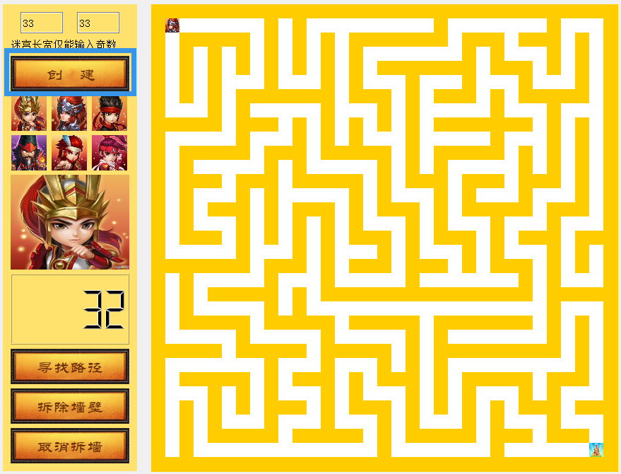
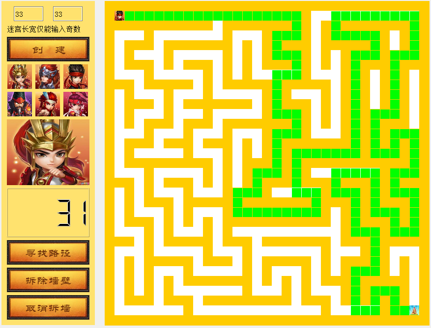
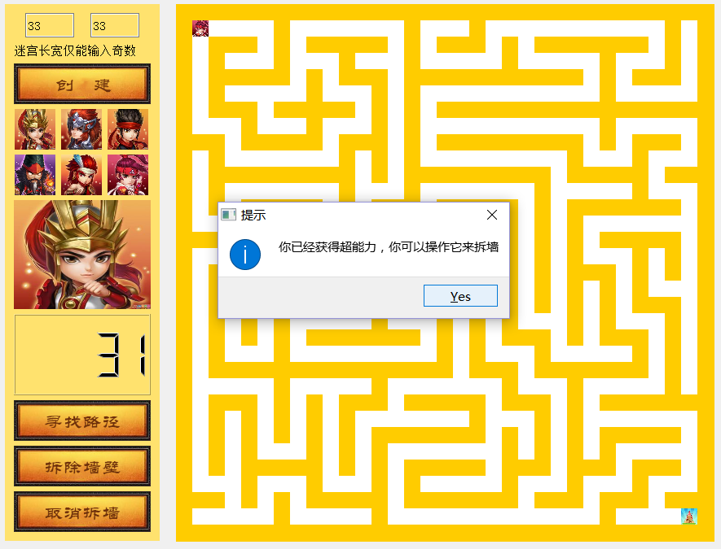
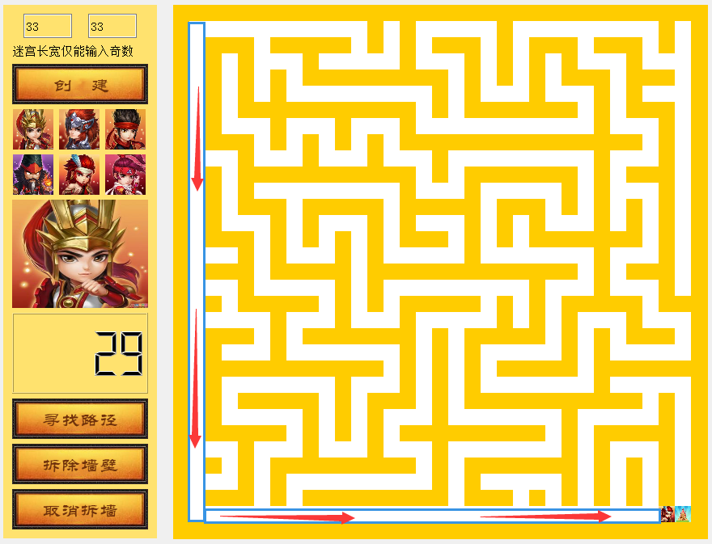

# maze
大二的windows游戏设计结课作业，我们小组完成的游戏是一个基于QT的游戏《迷宫》。

本游戏主要实现了人控制键盘使小人走出迷宫。玩家需要在规定的时间内从起点移动到终点。玩家可以根据自己的需求选择不同的头像以及创建不同规格的迷宫（仅限于大于五的奇数）。在游戏过程中，当人碰到墙壁的时候无法移动。当时间归零时，游戏结束。此游戏额外设置了两个功能，玩家在游戏过程中可以选择“寻找路径”，此时游戏界面会出现指向终点的最短路径；玩家也可以选择“拆除墙壁”，此时玩家将无视墙壁的存在，可以直接向终点移动，到达终点后游戏过关。

创建迷宫：

寻找路径：

拆除墙壁

